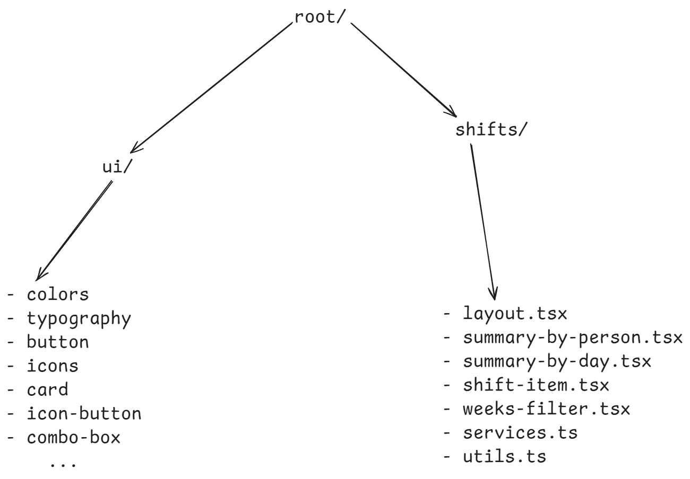
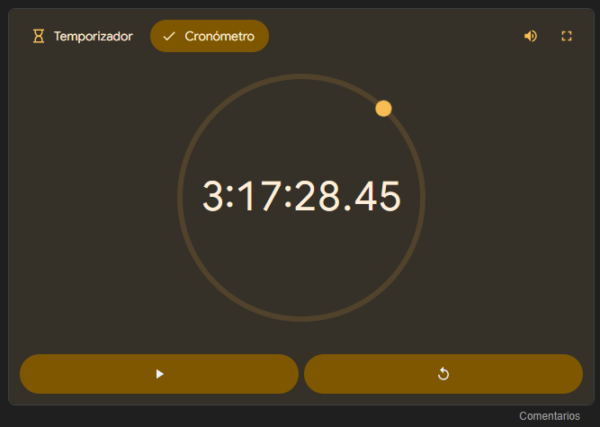

## Punto 1

Basado en los requerimientos principales del módulo, tendría los siguientes aspectos en cuenta:

- Llevar la nueva línea de diseño a un design system bien documentado que pueda ser reutilizado fácilmente.
- Considerando que los principales usuarios del módulo serán empresas con una gran cantidad de personas y que existe una integración con un servicio externo, buscaría la manera de implementar lo siguiente para mejorar la UX del usuario:
  - Implementar algún tipo de caché que permita optimizar la carga de los datos de forma que la UX del usuario no se vea afectada. Esta caché podría ser una **solución** del lado del servidor con herramientas como `redis` o `lru-cache`, o también podría implementarse desde el lado del cliente con una librería como `TanStack Query`.
  - Utilizar estrategias como paginación infinita combinada con prefetching para evitar que el usuario perciba tiempos de carga elevados.
- Sugerencia: en lugar de utilizar un modal para mostrar el detalle de los turnos por día y por persona, haría uso de una vista independiente con el fin de aprovechar mucho más el espacio de la pantalla. Esto permitiría mostrar mucha más información en cada momento y tendría la posibilidad de expandirse a mostrar el detalle de un turno en particular al mismo tiempo. De igual manera, utilizar un modal para realizar la edición de un turno, ya que de esta manera se puede aislar la atención del usuario en contraste con la vista principal.
- Para la descarga del resumen de turnos en Excel, implementaría una **solución** como SSE para hacerlo de forma asíncrona y que no sea una tarea bloqueante para el cliente, de forma que el usuario podría seguir utilizando la aplicación mientras espera que el archivo sea generado.

## Punto 3

### Fragmento 1

- **Problema**: el componente no funciona porque entra en un loop infinito de renders debido a que se está leyendo la variable `requestsLog` al mismo tiempo que se actualiza dentro del `useEffect`.
- **Solución**: el valor de la variable `requestsLog` se puede derivar a partir del valor de la variable `requestsCount`

### Fragmento 2

- **Mala práctica**: el componente utiliza muchas variables de estado diferentes para manejar información relacionada de la misma entidad, en este caso de un usuario.
- **Solución**: agrupar los datos relacionados en una sola variable `user`, o utilizar `useReducer` para centralizar los diferentes estados del componente y no solo lo que está relacionado con el formulario.
- **Mala práctica**: utiliza incorrectamente un `useEffect` para sincronizar la variable de estado adicional `userFullName`.
- **Solución**: el valor de la variable `userFullName` se puede derivar a partir de los valores previamente capturados de `userName` y `userLastname`.
- **Mala práctica**: actualiza estados de diferentes contextos y al mismo tiempo en el mismo event handler.
- **Solución**: utilizar `useReducer` para centralizar el estado del componente y hacer las actualizaciones correspondientes a partir de diferentes `actions`.

### Fragmento 3

- **Mala práctica**: utilizar `useCallback` de forma apresurada en event handlers que no lo requieren.
- **Solución**: dejar de utilizarlos y solo incluirlos cuando realmente este tipo de optimizaciones hagan una diferencia ya que su uso representa un costo computacional.
- **Mala práctica**: utilizar `useMemo` de forma apresurada para calcular valores que no representan un costo significativo al momento de ser recalculados.
- **Solución**: dejar de utilizarlo y solo incluirlo cuando se recalculan datos que representan un costo alto para la cpu.
- **Problema**: uso incorrecto de la API `memo` en un componente que no verifica la estabilidad de sus props. Además el componente está recibiendo una prop que no es estable entre un render y otro.
- **Solución**: utilizar `useCallback` en la función `handleReset` para que sea estable al pasarla como prop al componente `SuperExpensiveChild` o hacer uso del segundo parámetro de la función `memo`, que es una función que permite comparar los valores de las props actuales y siguientes del componente para ver si se debe renderizar nuevamente o no.

## Tiempo

